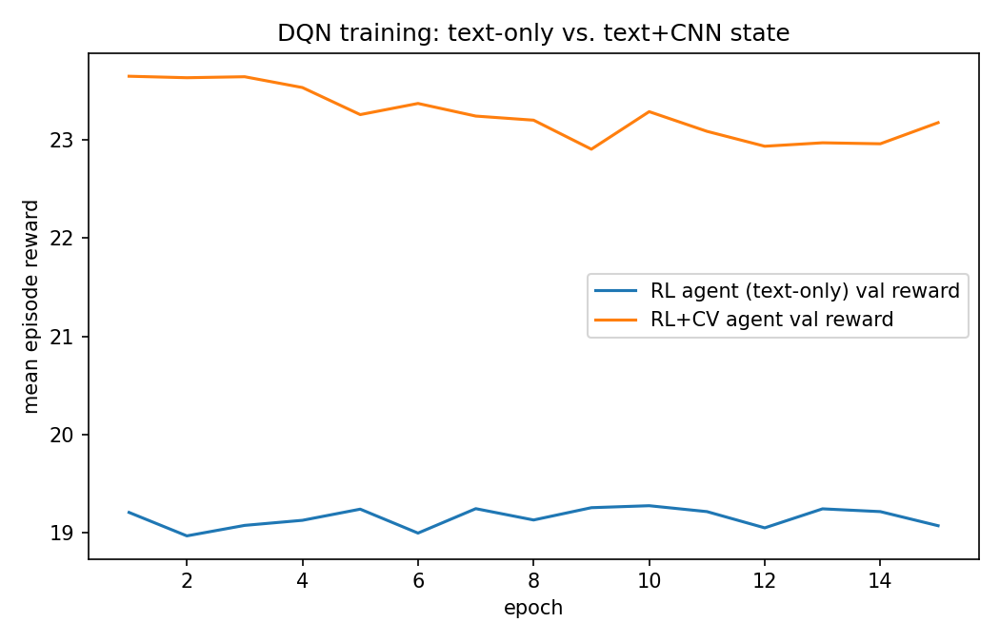
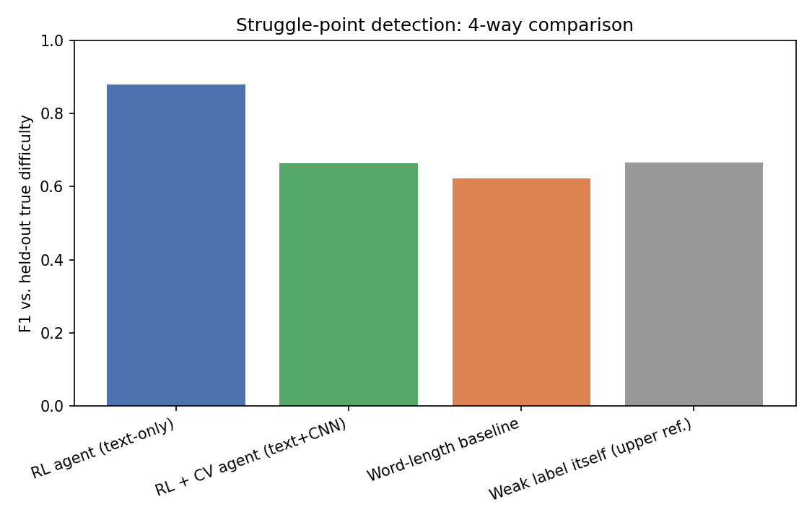

# Gaze-RL-Reading: RL + CNN-Based Visual Modeling for Reading-Difficulty Detection from Weak Gaze Supervision

A portfolio project built to support an application to the **ZHAW/UZH LitAI PhD
position** (*Software Engineering and Machine Learning for Sustainable
AI-Supported Reading Technologies*), and a direct extension of two earlier
projects:

- **M.Sc. thesis** ([Symbolic-RL-Fredholm-Solver](https://github.com/saqarkpr/Symbolic-RL-Fredholm-Solver)) — a DQN agent solving Fredholm integral equations by framing numerical approximation as a sequential decision process.
- **RLVF** (RL from Verified Feedback) — DPO-tuning an LLM on symbolic math using a *programmatic verifier* instead of human preference labels.

This project asks two questions: **(1) does the "sequential decisions +
programmatic reward" recipe transfer from symbolic math to reading gaze
data**, and **(2) does adding a CNN-based visual representation of gaze
patterns actually help, or can it hurt?**

## Problem framing

LitAI's core technical challenge is detecting where a reader struggles from
eye-tracking (gaze) data, in order to trigger targeted support. Hand-labeling
"this word was difficult for this reader" at scale is expensive. This project
tests a cheaper alternative: derive a **weak, programmatic struggle signal**
directly from gaze behavior (fixation duration, dwell time, regressions), and
train an RL agent to predict likely struggle points **from text alone** —
useful for a *new* reader, before any of their own gaze data exists.

## Why synthetic data

Real corpora (GECO, Provo Corpus, ZuCo) require external hosting/licensing
this environment can't reach. To validate the *approach* end-to-end quickly,
`data_gen.py` simulates passages with a **hidden difficulty ground truth**
(word length / rarity / burstiness) and noisy gaze features designed to
mimic plausible relationships between gaze behavior and reading difficulty
— this relationship is designed, not measured, and has not been validated
against real eye-tracking data. **The true difficulty signal is completely
held out from training and used only for final evaluation**, mirroring how
a deployed system would be validated against held-out human/behavioral
outcomes it never trained on.

## Pipeline

```
data_gen.py          synthetic passages + simulated per-token gaze features
                      (fixation_ms, dwell_ms, regressed) + hidden true_difficulty
weak_supervision.py   gaze features -> weak struggle score/label (the "verifier",
                      analogous to the programmatic math verifier in RLVF)

--- text-only RL branch ---
env.py                RL environment using hand-crafted text features
dqn.py                DQN agent (Q-network, replay buffer, target net, eps decay)
train.py              trains the text-only agent using the weak label
                       -> outputs/q_net.pt

--- RL + Computer Vision branch ---
gaze_heatmap.py        renders each token's local gaze pattern as a small
                        28x28 image (a scanpath/heatmap patch) -- a
                        project-specific representation, loosely inspired
                        by (but not a reproduction of) the general idea,
                        used in some eye-tracking work, of turning raw
                        fixation coordinates into an image before a CNN
                        sees them
cnn_model.py            a small 2-conv-layer CNN (GazeCNN) that reads the
                        image and outputs an 8-number learned embedding
pretrain_cnn.py         supervised pretraining of the CNN on the weak label
                        (plain classification, not RL) -> outputs/gaze_cnn.pt
env_cv.py               same RL environment, but the agent's state is now
                        [text features (4)] + [frozen CNN embedding (8)] = 12
train_cv.py             trains a second DQN agent on this fused state
                        -> outputs/q_net_cv.pt

evaluate.py            scores all four methods against held-out true_difficulty
```

## Results (synthetic test set, 60 passages)

| Method                          | Precision | Recall | F1    |
|----------------------------------|-----------|--------|-------|
| **RL agent (text-only)**         | 1.000     | 0.784  | **0.879** |
| RL + CV agent (text + CNN)        | 0.742     | 0.600  | 0.664 |
| Word-length baseline             | 0.509     | 0.801  | 0.623 |
| Weak label itself (upper ref.)   | 0.745     | 0.603  | 0.667 |

Both agents are evaluated against `true_difficulty`, a field neither ever saw
during training.




## The honest, more interesting finding

Adding the CNN did **not** help — it made things worse on the metric that
actually matters, which is itself the useful result. During training, the
CV agent reaches a *higher* reward than the text-only agent (~23 vs. ~19,
see the training curve), but reward there is measured against the **weak
label**, and the CNN embedding was trained specifically to predict that
same weak label. A plausible explanation is that handing the agent a
feature already aligned with the proxy signal makes it easy to match the
proxy closely — including its noise — while the text-only agent, with a
smaller, coarser feature set, can't fit that noise as tightly, and that
constraint happens to act as a regularizer with respect to the true,
hidden difficulty it was never shown. This single experiment doesn't
establish that mechanism as fact — it's a plausible interpretation, not a
controlled ablation isolating the cause.

This suggests a weak-supervision/reward-hacking failure mode: optimizing
hard against a noisy proxy signal can actively hurt performance on the
target you actually care about. For a project positioned around LitAI — a
system that will also have to learn from gaze as an imperfect proxy for
real reading difficulty — finding and reporting this honestly seemed more
useful than a clean "CV helps" result would have been.

## Honest limitations

- **Synthetic data only.** The next step, if taken further at LitAI, would be
  validating this pipeline on a real corpus (GECO / Provo Corpus) with actual
  eye-tracker output and real comprehension outcomes.
- **Hand-set difficulty/frequency proxies**, not a real language model or
  psycholinguistic frequency database.
- **No linguistic or syntactic features** (parse depth, syntactic ambiguity)
  — a real LitAI system would need these; this project isolates the RL +
  weak-supervision (and RL + CV) mechanisms first.
- **The CV result is best read as a lesson about proxy-signal overfitting**,
  not proof that CV can't help — a natural follow-up (noted but not built
  here) would be training the CNN on a signal that is *not* identical to the
  RL reward (e.g. raw fixation coordinates or a held-out slice of gaze data),
  so its embedding adds information instead of restating the same proxy.

## Relevance to LitAI

This project is a small proof of concept for the mechanism, not a finished
reading system: it tests whether sequential decision-making with
programmatic behavioral supervision transfers to a new domain, and — just
as importantly — surfaces, with a real experiment rather than an
assumption, a concrete way that approach can go wrong when a second model
is trained on the same imperfect proxy.
